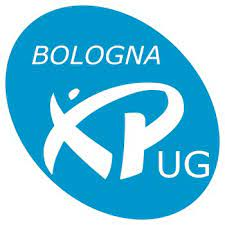

A gentle intro to TLA+
======================

_thinking above the code level_

Temporal Logic of Actions
-------------------------
- a logical formalism
- based on simple math
- to describe systems

_[Giacomo Citi](https://twitter.com/giacomociti) - 4/5/2021_
