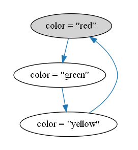

Systems as State Machines
=========================

- a behavior is a sequence of states
- a state is an assigment of values to variables
- the system is descibed by a formula about behaviors
    - that's true on behaviors that represent a possible system execution
    - usually obtained combining two formulas:
        - _Init_ to describe initial states
        - _Next_ to describe state transitions

