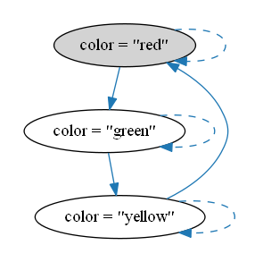

Stuttering
==========

A specification should allow stuttering steps - ones that leave
unchanged all the variables appearing in the formula.

A stuttering step represents a change only to some part of the system not descibed by the formula; adding it to the behavior should not affect the truth of the formula.

Stuttering invariance enables composition (_and_) and refinement (_implies_)
